<!-- Hero Section -->

<h1 align="center">Hi 👋 I'm ENES</h1>
<h3 align="center">Data Analytics & Data Engineering | Building reliable data for better business decisions

---

  

<!-- Hero Section -->

<!-- Eski animasyon

-->

  

  

  

  

  

##  📌 My Profile

I am a data enthusiast with hands-on experience in both **Data Analytics** and **Data Engineering**.

I enjoy working with the full data process — from collecting and cleaning raw data to building data pipelines, creating analytics-ready datasets, and finding useful business insights.

My main tools include **SQL, Python, PySpark, Databricks, AWS S3, Tableau, and Power BI**. I have built projects in data warehousing, ETL pipelines, data cleaning, exploratory data analysis, dashboard development, and predictive analysis.

I have experience designing **Star Schema data models**, developing **Bronze–Silver–Gold pipelines**, applying data quality checks, and preparing reliable datasets for reporting and decision-making.

I also enjoy analyzing business problems, identifying trends, building KPIs, and presenting results in a clear and simple way.

My approach to data is:

**Understand the problem → Build reliable data → Find useful insights → Communicate clearly**

I am interested in opportunities where I can combine analytical thinking with technical skills to build useful, scalable, and business-focused data solutions.

## 💡 Core Strengths

- Building **end-to-end data solutions** from raw data to **validated, decision-ready datasets** and business insights
- Designing **SQL data warehouses**, **Star Schema** models with **fact** and **dimension** tables
- Developing **Bronze–Silver–Gold ETL pipelines** using SQL Server, PySpark, Databricks, and AWS S3
- Cleaning, transforming, and validating data with a strong **data quality** mindset
- Writing clean, efficient, and maintainable **SQL** for ETL, reporting, analytics, and automation
- Building reliable **analytics-ready datasets** and reusable data models
- Exploring data to identify trends, create meaningful **KPIs**, and support business decision-making
- Creating dashboards and reports that are **clear, reliable, and easy to use**
- Solving complex data challenges such as missing values, duplicates, inconsistent formats, and messy joins
- Communicating technical findings in a simple, clear, and business-friendly way

---

  **SQL • SQL Server • Python • PySpark • Databricks • AWS S3 • ETL/ELT • Structured Streaming • Data Warehousing • Medallion Architecture • Star Schema • Data Modeling • Data Cleaning • Data Validation • Data Quality • EDA • Statistics • KPI Design • Reporting • Dashboards • Tableau • Power BI • Git • GitHub**

---

## 🎯 Current focus

- Building more **end-to-end data projects** that combine **Data Analytics** and **Data Engineering**
- Improving my skills in **SQL Server**, **PySpark**, **Databricks**, and **AWS** for scalable data solutions
- Designing robust **Data Warehouses**, **Star Schema** models, and **Bronze–Silver–Gold** ETL pipelines
- Strengthening my knowledge of **data modeling**, **data quality**, and pipeline optimization
- Creating more business-focused dashboards and analytics projects with clear KPIs and actionable insights
- Expanding my **Machine Learning** knowledge through practical, real-world projects

---

## ⭐ Career Goal

To build a career where technical skills, curiosity, continuous learning, and collaboration come together to solve real business challenges with data.

---

## 📂 Highlight Projects

- ⚡ **SQL Data Warehouse Project (SQL Server | ETL | Data Warehousing)**  
  Built a centralized SQL Server data warehouse using **Bronze–Silver–Gold architecture**, integrating CRM and ERP data into analytics-ready datasets. Designed a **Star Schema** with fact and dimension tables, implemented ETL pipelines, and applied comprehensive data quality validation.

  👉 https://github.com/folkwinr/SQL-Data-Warehouse-Project

---

- 🚀 **Databricks End-to-End ETL Pipeline (PySpark | Databricks | AWS S3)**  
  Developed an automated, event-driven ETL pipeline that ingests transaction data from AWS S3 into Databricks. Applied PySpark transformations, data quality checks, and built Gold-layer business metrics for reporting and analytics.

  👉 https://github.com/folkwinr/Databricks-End-to-End-ETL-Pipeline

---

- ⚡ **U.S. EV Market Analysis (SQL Server | Tableau)**  
  Built an end-to-end SQL analytics pipeline to clean, validate, and analyze U.S. electric vehicle registration data. Prepared Tableau-ready datasets and dashboards for KPI tracking, regional comparisons, and EV adoption insights.

  👉 https://github.com/folkwinr/US-EV-Market-Analysis

---

- 🚗 **Car Data Cleaning & EDA (Python | Pandas)**  
  Cleaned and transformed over **29,000** used car listings into an analysis-ready dataset through data preprocessing, feature engineering, and exploratory data analysis to uncover pricing patterns and market trends.

  👉 https://github.com/folkwinr/Car-Data-Cleaning-and-EDA

---

- 🏠 **Paris Airbnb Pricing & Regulation Impact (Python | Pandas)**  
  Analyzed more than **64,000** Airbnb listings to explore pricing trends, neighborhood differences, and the impact of the 2015 regulation using data cleaning, visualization, and exploratory analysis.

  👉 https://github.com/folkwinr/Paris-Airbnb-Pricing-and-Regulation-Impact-2015

  ---

## 🛠️ Tech Stack

#### 💻 Programming Languages

---

#### 🗄️ Data Engineering

---

#### 🏛️ Data Warehousing

---

#### 📊 Data Analytics

---

#### 📈 Business Intelligence

---

#### 🛠️ Tools & Workflow

---

#### 📚 Currently Learning

---

### 🔥 Streak Stats

---

### 📈 Activity Graph

---

<!--
## 🚀 GitHub Stats

-->

---

## 📫 Let’s Connect

- 📧 Email: **ynikenes@gmail.com**  
- 💼 LinkedIn: ****  

> If you’re looking for someone who enjoys mixing **statistics, code and business logic**, we should definitely talk. 🙂
>

 
  

